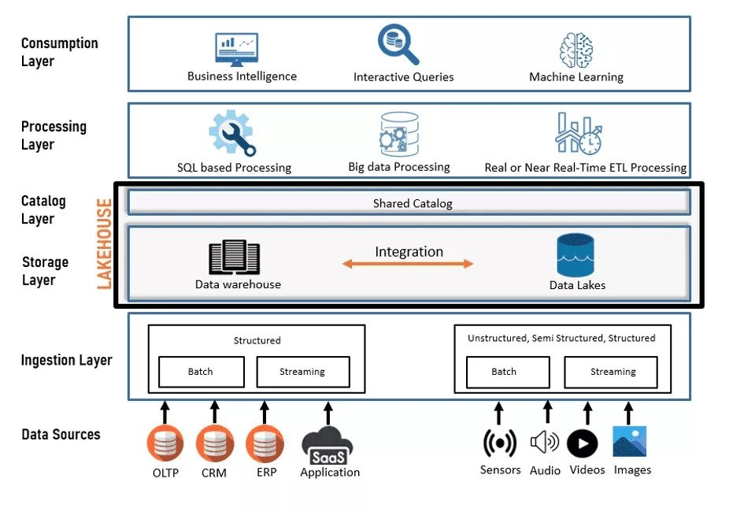
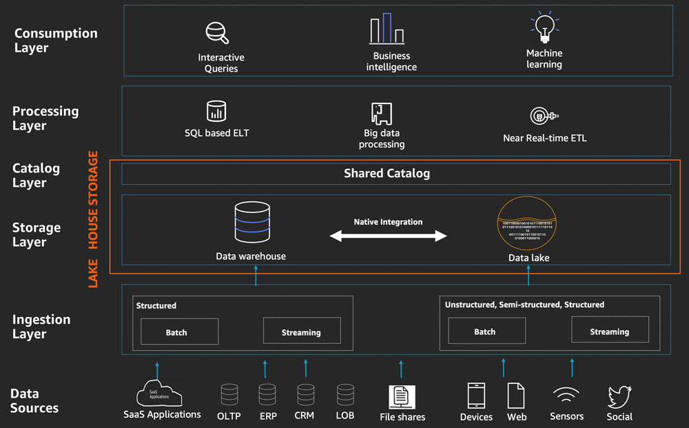
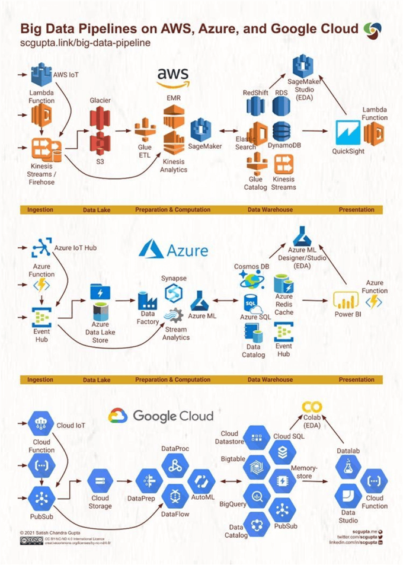
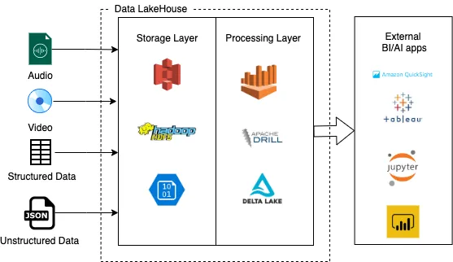
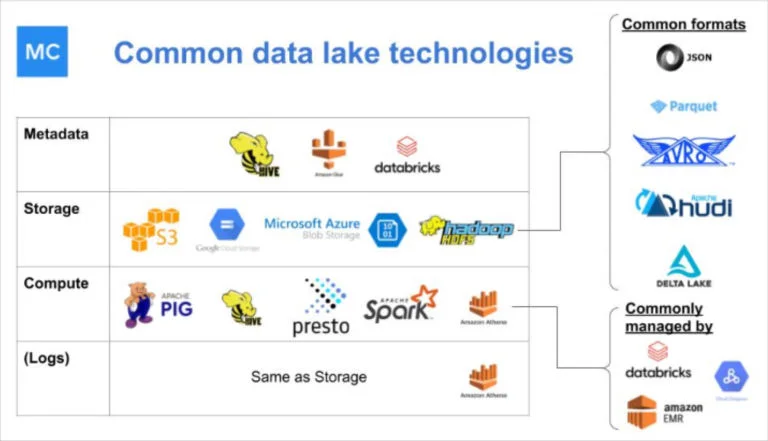

# Data Lakehouse Local Stack

**Data Lakehouse local stack with PySpark, Trino, and Minio**

This repository aims to introduce the Data Lakehouse pattern as a suitable and flexible solution to transit small companies to established enterprises, allowing to implement a local data lakehouse from OpenSource solutions, compatible with Cloud production grade tools.

It also includes an [example to process Raygun error data and the IP address occurrence](#raygun-data-processing).

## Introduction

In the world of ML and AI, **data** is the crown jewel, but it's normally lost in [Swamps](https://www.superannotate.com/blog/data-lakes-vs-data-swamps-vs-data-warehouse) due to bad practices with **Data Lakes** when companies try to productionize their data.

**Data Warehouses** are costly solutions for this problem, and increase the complexity of simple Data Lakes.

Here's where **Data Lakehouses** come into action, being a hybrid solution with the best of both worlds. ([source](https://2024.pycon.co/en/talks/23)).

**Data Lakehouses** aim to combine elements of data warehousing with core elements of data lakes. Put simply, they are designed to provide the lower costs of cloud storage even for large amounts of raw data alongside support for certain analytics concepts – such as SQL access to curated and structured data tables stored in relational databases, or support for large scale processing of Big Data analytics or Machine Learning workloads ([source](https://www.exasol.com/resource/data-lake-warehouse-or-lakehouse/)).

<!--
<BR/>
([Image source](https://www.linkedin.com/pulse/lakehouse-convergence-data-warehousing-science-dr-mahendra/))
-->

<BR/>
([Image source](https://www.databricks.com/glossary/data-lakehouse))

## The Medallion Architecture

A medallion architecture is a data design pattern used to logically organize data in a lakehouse, with the goal of incrementally and progressively improving the structure and quality of data as it flows through each layer of the architecture (from Bronze ⇒ Silver ⇒ Gold layer tables). Medallion architectures are sometimes also referred to as "multi-hop" architectures.

<BR/>
([Image source](https://www.databricks.com/glossary/medallion-architecture))

* Bronze: ingestion tables (raw data, originals).

* Silver: refined/cleaned tables.

* Gold: feature/aggregated data store.

* Platinum (optional): in a faster format like a high-speed DBMS, because `gold` is stored in cloud bucket storage (like AWS S3), and it's slow for e.g. real-time dashboard.

Readings:

* https://www.databricks.com/glossary/medallion-architecture
* https://learn.microsoft.com/en-us/azure/databricks/lakehouse/medallion
* https://medium.com/@junshan0/medallion-architecture-what-why-and-how-ce07421ef06f

## Data Lakehouse Layers

<!--
<BR/>
([Image source](https://www.visionet.com/blog/data-lakehouse-the-future-of-modern-data-warehousing-analytics))
-->
<BR/>
([Image source](https://aws.amazon.com/es/blogs/big-data/build-a-lake-house-architecture-on-aws/))

Storing structured and unstructured data in a data lakehouse presents many benefits to a data organization, namely making it easier and more seamless to support both business intelligence and data science workloads. This starts at the data source.

We describe the five layers in this section, but let’s first talk about the sources that feed the Lake House Architecture.

### Data sources

The Lake House Architecture enables you to ingest and analyze data from a variety of sources. Many of these sources such as line of business (LOB) applications, ERP applications, and CRM applications generate highly structured batches of data at fixed intervals. In addition to internal structured sources, you can receive data from modern sources such as web applications, mobile devices, sensors, video streams, and social media. These modern sources typically generate semi-structured and unstructured data, often as continuous streams.

### Data ingestion layer

The ingestion layer is responsible for ingesting data into the Lake House storage layer. It provides the ability to connect to internal and external data sources over a variety of protocols. It can ingest and deliver batch as well as real-time streaming data into a data warehouse as well as data lake components of the Lake House storage layer.

### Data storage layer

The data storage layer is responsible for providing durable, scalable, and cost-effective components to store and manage vast quantities of data. In a Lake House Architecture, the data warehouse and data lake natively integrate to provide an integrated cost-effective storage layer that supports unstructured as well as highly structured and modeled data. The storage layer can store data in different states of consumption readiness, including raw, trusted-conformed, enriched, and modeled.

### Catalog layer

The catalog layer is responsible for storing business and technical metadata about datasets hosted in the Lake House storage layer. In a Lake House Architecture, the catalog is shared by both the data lake and data warehouse, and enables writing queries that incorporate data stored in the data lake as well as the data warehouse in the same SQL. It allows you to track versioned schemas and granular partitioning information of datasets. As the number of datasets grows, this layer makes datasets in the Lake House discoverable by providing search capabilities.

### Processing layer

Components in the processing layer are responsible for transforming data into a consumable state through data validation, cleanup, normalization, transformation, and enrichment. The processing layer provides purpose-built components to perform a variety of transformations, including data warehouse style SQL, big data processing, and near-real-time ETL.

### Data consumption layer

The data consumption layer is responsible for providing scalable and performant components that use unified Lake House interfaces to access all the data stored in Lake House storage and all the metadata stored in the Lake House catalog. It democratizes analytics to enable all personas across an organization by providing purpose-built components that enable analysis methods, including interactive SQL queries, warehouse style analytics, BI dashboards, and ML.

Sources:
* [https://aws.amazon.com/es/blogs/big-data/build-a-lake-house-architecture-on-aws/](https://aws.amazon.com/es/blogs/big-data/build-a-lake-house-architecture-on-aws/)
* [https://www.montecarlodata.com/blog-data-lakehouse-architecture-5-layers/](https://www.montecarlodata.com/blog-data-lakehouse-architecture-5-layers/)
* [https://www.visionet.com/blog/data-lakehouse-the-future-of-modern-data-warehousing-analytics](https://www.visionet.com/blog/data-lakehouse-the-future-of-modern-data-warehousing-analytics)

## Data LakeHouse Components by Cloud Providers

<BR/>
([Image source](https://www.mssqltips.com/sqlservertip/7316/cloud-data-lakehouse-success-story-architecture-outcomes-lessons-learned/))

## Local Data Lakehouse Components

<!--
<BR/>
([Image source](https://medium.com/adfolks/data-lakehouse-paradigm-of-decade-caa286f5b7a1))

<BR/>
([Image source](https://www.montecarlodata.com/blog-data-lake-vs-data-warehouse))
-->


* **Minio**<BR/>
  Data sources, storage layer, landing buckets.<BR/>
  [https://min.io](https://min.io)

* **Apache Spark**<BR/>
  Processing layer, compute.<BR/>
  [https://spark.apache.org](https://spark.apache.org)<BR/>
  [https://spark.apache.org/docs/latest/api/python/index.html](https://spark.apache.org/docs/latest/api/python/index.html)<BR/>
[https://sparkbyexamples.com/pyspark-tutorial/](https://sparkbyexamples.com/pyspark-tutorial/)<BR/>

* **Apache Hive**<BR/>
  Data catalog, catalog layer, metadata.<BR/>
  [https://hive.apache.org](https://hive.apache.org)

* **Postgres Database**<BR/>
  Data catalog persistence.<BR/>
  [https://www.postgresql.org](https://www.postgresql.org)

* **Trino**<BR/>
  Query engine and data governance.<BR/>
  [https://trino.io](https://trino.io)

## Other Components

* **SQL Alchemy**<BR/>
  [https://docs.sqlalchemy.org](https://docs.sqlalchemy.org)

* **Pandas**<BR/>
  [https://pandas.pydata.org](https://pandas.pydata.org)

* **Jupiter Lab**<BR/>
  [https://docs.jupyter.org](https://docs.jupyter.org)

* **Delta Lake**<BR/>
  Open table format.<BR/>
  [https://delta.io](https://delta.io)<BR/>
  Open source framework developed by Databricks. Like other modern table formats, it employs file-level listings, improving the speed of queries considerably compared to the  directory-level listing of Hive. Offers enhanced CRUD operations, including the ability to update and delete records in a data lake which would previously have been immutable.<BR/>
  (Click [here](https://www.starburst.io/data-glossary/open-table-formats/) for more information about Open Table Formats).<BR/>

## Requirements

* [Git](https://www.atlassian.com/git/tutorials/install-git)
* Make: [Mac](https://formulae.brew.sh/formula/make) | [Windows](https://stackoverflow.com/questions/32127524/how-to-install-and-use-make-in-windows)
* [Docker and Docker Composer](https://www.docker.com/products/docker-desktop)
* [wget](https://www.jcchouinard.com/wget-install/)

## Usage

Clone the respository:

```bash
git clone https://github.com/tomkat-cr/data_lakehouse_local_stack.git
cd data_lakehouse_local_stack
```

Download the required packages:

```bash
make install
```

**IMPORTANT**: this process will take a long time, depending on your Internet connection speed.

Start the local stack (or `spark stack`):

```bash
make run
```

Run the local Jupiter engine:

```bash
make open_local_jupiter
```

Run the local Minio explorer:

```bash
make open_local_minio
```

## Raygun Data Processing

To process a single Raygun error you need to download the Raygun data, composed by a series of JSON files for each time the error happens with all data shown in Raygun, upload the data to S3 (managed locally by Minio), ingest the data using Spark, build the Hive metastore and finally run the SQL queries to get the data analytics.

### Raygun Data Preparation

1. Go to Raygun ([https://app.raygun.com](https://app.raygun.com)), and select the corresponding Application.

2. Put the checkmark in the error you want to analyze.

3. Click on the `Export selected groups` button.

4. Click on the `Add to export list` button.

5. A message like this will be shown:

```
Great work! Those error groups have been added to the export list.
View your exports by clicking here, or by using the "Export" link under "Crash Reporting" in the sidebar.
```

6. Under `Crash Reporting` in the sidebar, click on the `Export` link.

7. Click on the `Start export` button.

```
Confirm export

Export all errors between XXXX and YYYY.

Exports can take some time depending on the volume of errors being exported. You will be notified when your export is ready to be downloaded. Once an export is started, another cannot begin until the first has completed.

Exports are generated as a single compressed file. [Learn how to extract them](https://raygun.com/documentation/product-guides/crash-reporting/exporting-data/)

Recipients:
example@address.com
```

8. Click on the `Start export` button.

9. Wait until the compressed file arraives to your email inbox.

10. A message arrives to your inbox like this:

```
Subject: Your Raygun Crash Reporting export is complete for "XXXX"

Your error export has been generated
We have completed the error group export for your application "XXXX". You can now download it below.
Download export - XXX MB
Learn how to extract 7z files
```

11. Click on the `Download export - XXX MB` link.

12. Put the compressed file in a local directory like `${HOME}/Downloads/raygun-data`

13. Uncompress the file.

14. A new directory will be created with the JSON files, each one with an error for a date/time, in the directory: `${HOME}/Downloads/raygun-data/assets`

15. To check the total input file size:

Set an environment variable with the path:

```sh
ORIGINAL_JSON_FILES_PATH="${HOME}/Downloads/raygun-data/assets"
```

Get the total size for all files downloaded:

```sh
du -sh ${ORIGINAL_JSON_FILES_PATH}
```

Count the number of files in that directory:

```sh
ls -l ${ORIGINAL_JSON_FILES_PATH} | wc -l
```

16. Move the files to the `data/raygun` directory in the Project, or perform the `Large number of input data files` procedure (see next section) to link the `${HOME}/Downloads/raygun-data/assets` to the `data/raygun` directory.

### Large number of input data files

If you have more than 1000 raw data input files, you can use the following procedure to mount the input files directory in the local stack `data` directory:

1. Edit the docker-compose configuration file in the project's root:

```sh
vi ./docker-compose.yml
```

2. Add the `data/any_directory_name` input files directory in the `volumnes` section, changing `any_directory_name` with the name of yours, e.g. `raygun`:

File: `./docker-compose.yml`

```yaml
version: "3.9"
services:
  spark:
      .
      .
    volumes:
      - /path/to/input/directory/:/home/LocalLakeHouse/Project/data/any_directory_name
```

So your massive input files will be under the `data/any_directory_name` directory.

3. You can also do it by a symbolic link:

```sh
ln -s /path/to/input/directory/ data/any_directory_name
```

4. Once you finish the ingestion process (see `Raygun Data Ingestion` section), the link can be removed:

Exit the `spark` docker container by pressing Ctrl-D (or running the `exit` command), and run:

```sh
unlink data/any_directory_name
```

### Configuration

1. Change the current directory to the Raygun processing path:

```sh
cd /home/LocalLakeHouse/Project/batch_processing/raygun_ip_processing
```

2. Copy the configuration template:

```sh
cp processing.example.env processing.env
```

3. Edit the configuration file:

```sh
vi processing.example.env processing.env
```

4. Assign the Spark App Name:

```env
SPARK_APPNAME=RaygunErrorTraceAnalysis
```

5. Assign the data input sub-directory (under `BASE_PATH` or `/home/LocalLakeHouse/Project`):

```env
# Local directory path containing JSON files
INPUT_LOCAL_DIRECTORY="data/raygun"
```

6. Assign the Local S3 (Minio) raw data input sub-directory:

```env
# S3 prefix (directory path in the bucket) to store raw data read from
# the local directory
S3_PREFIX="Raw/raygun"
```

7. Assign the Cluster storage bucket name, to save the processed Dataframes and be able to resume the execution from the last one when any error aborts the process:

```env
# Dataframe cluster storage bucket name
DF_CLUSTER_STORAGE_BUCKET_PREFIX="ClusterData/RaygunIpSummary"
```

8. Assign the attribute name and alias for the IP Address in the Raygun JSON files:

```env
# Desired attribute and alias to filter one column
DESIRED_ATTRIBUTE="Request.IpAddress"
DESIRED_ALIAS=RequestIpAddress
```

9. Assign the results sub-directory (under `/home/LocalLakeHouse/Project/Outputs`)

```env
# Final output result sub-directory
RESULTS_SUB_DIRECTORY=raygun_ip_addresses_summary
```

10. Assign the input files reading page size, to prevent errors building the list of large amounts of files.

```env
# S3 pagination page size: 1000 files chunks
S3_PAGE_SIZE-1000
```

11. Define the batch size, to read the JSON files in batches during the Spark Dataframe creation. Adjust the batch size based on your memory capacity and data size. 5000 works well in a MacBook with 16 GB of RAM.

```env
# Spark Dataframe creation batch size: 5000 files per batch.
DF_READ_BATCH_SIZE=5000
```

12. Assign the Spark driver memory. For example, the Raygun JSON event files have 16 Kb each (small files).

```env
# Spark driver memory
# "3g" for small files it's better 2-3g
# "12g" for big files with more data it's better 4-5g
SPARK_DRIVER_MEMORY=3g
```

13. Assign the Spark number of partitions, to optimize parallel processing and memory usage:

```env
# Repartition the DataFrame to optimize parallel processing and memory usage
# (Adjust the number of partitions based on your environment and data size,
#  workload and cluster setup)
DF_NUM_PARTITIONS=200
```

14. Assign the number of batches to save Data into the Apache Hive metastore, to prevent errors saving large amounts of files.

```env
# Number of batches to Save Data into Apache Hive
HIVE_BATCHES=10
```

15. For other parameters check the [Raygun IP processing main Python code](batch_processing/raygun_ip_processing/main.py), function `get_config()`.


### Raygun Data Copy to S3 / Minio

1. In a terminal window, restart the `spark stack`:

If the local stack is already running, press Ctrl-C to stop it.

Run this command:

```sh
make run
```

The spark stak docker container will have a `/home/LocalLakeHouse/Project` directory that's the Project's root directory in your local computer.

2. Open a second terminal window and enter to the `spark` docker container:

```sh
docker exec -ti spark bash
```

3. Then run the load script:

```sh
cd /home/LocalLakeHouse/Project
sh ./Scripts/1.init_minio.sh data/raygun
```

### Raygun Data Ingestion

1. Run the ingest process:

Open a terminal window and enter to the `spark` docker container:

```sh
docker exec -ti spark bash
```

Run the ingestion process from scratch:

```sh
cd Project
MODE=ingest make raygun_ip_processing
```

When the ingestion process ends, the `Build the Hive Metastore` and `Raygun Data Reporting` will run as well.


2. If the process stops, copy the counter XXXX after the last `Persisting...` message:

For example:

```
Persisting DataFrame to disk (round X)...
3) From: XXXX | To: YYYY
```

Then run:

```sh
MODE=ingest FROM=XXXX make raygun_ip_processing
```

### Build the Hive Metastore

If the ingestion process stops and you don't want to resume/finish it, you can run the Hive metastore building, and be able to run the SQL queries and build the reports:

```sh
MODE=hive_process make raygun_ip_processing
```

### Raygun Data Reporting

1. To run the default SQL query using Spark:

```sh
MODE=spark_sql make raygun_ip_processing
```

This process generates a report in the Project's `Outputs/raygun_ip_addresses_summary` directory, where you will find a `part-00000-<some-headecimal-code>.csv` file with the results.

The default SQL query that generates the results file is:

```sql
SELECT RequestIpAddress, COUNT(*) AS IpCount
  FROM raygun_error_traces
  GROUP BY RequestIpAddress
  ORDER BY IpCount DESC
```

The result will be the list of IP addresses and the number of times those IPs are in all the Requests evaluated.

2. To run a custom SQL query using Spark:

```sh
SQL='SELECT RequestIpAddress FROM raygun_error_traces GROUP BY RequestIpAddress' MODE=spark_sql make raygun_ip_processing
```

3. To run the default SQL query using Trino:

```sh
MODE=trino_sql make raygun_ip_processing
```

### Ingest process stats

1. To check the Dataframe cluster S3 (Minio) files:

This way you can do the ingestion process follow-up because during the Dataframe build step in the ingest process, files are processed in batches (groups of 5,000 files), and each time a batch finishes, the result is written to the S3 cluster directory. If the ingestion process stops, it can be resumed from the last executed batch, and the processed files will be appended to the S3 cluster directory.

Set an environment variable with the path:

```sh
CLUSTER_DIRECTORY="/home/LocalLakeHouse/Project/Storage/minio/data-lakehouse/ClusterData/RaygunIpSummary"
```

The parquet files resulting from the Dataframe build part in the ingestion process. are in the path assigned to `CLUSTER_DIRECTORY`.

Get the total size for all files currently processed in the Dataframe:

```sh
du -sh ${CLUSTER_DIRECTORY}
```

Count the number of files in that directory:

```sh
ls -l ${CLUSTER_DIRECTORY} | wc -l
```

2. To check the raw input JSON files uploaded to S3 (Minio):

Set an environment variable with the path:

```sh
S3_JSON_FILES_PATH="/home/LocalLakeHouse/Project/Storage/minio/data-lakehouse/Raw/raygun"
```

Get the total size for all files:

```sh
du -sh ${S3_JSON_FILES_PATH}
```

Count the number of files in that directory:

```sh
ls -l ${S3_JSON_FILES_PATH} | wc -l
```

## Minio UI

1. Run the local Minio explorer:

```bash
make open_local_minio
```

2. Automatically this URL will be opened in a Browser: [http://127.0.0.1:9001](http://127.0.0.1:9001)

3. The credentials for the login are in the `minio.env` file:<BR/>
   Username (`MINIO_ACCESS_KEY`): minio_ak<BR/>
   Password (`MINIO_SECRET_KEY`): minio_sk<BR/>

## Monitor Spark processes

To access the `pyspark` web UI:

1. Run the following command in a terminal window:

```sh
make open_pyspark_ui
```

It runs the following command:

```sh
docker exec -ti spark pyspark
```

2. Go to this URL in a Browser: [http://127.0.0.1:4040](http://127.0.0.1:4040)

## Run the local Jupiter Notebooks

1. Run the local Jupiter engine:

```bash
make open_local_jupiter
```

2. Automatically this URL will be opened in a Browser: [http://127.0.0.1:8888/lab](http://127.0.0.1:8888/lab)

3. A screen will appear asking for the  `Password or token` to authenticate.<BR/>
   It can be found in the  `docker attach` screen (the one that stays running when you execute `make run` to start the `spark stack`).

4. Seach for a message like this:<BR/>
    `http://127.0.0.1:8888/lab?token=xxxx`

5. The `xxxx` is the `Password or token` to authenticate.

## Connect to the Jupiter Server in VSC

To connect the Jupiter Server in VSC (Visual Studio Code):

1. In the docker attach screen, look for a message like this:<BR/>
    `http://127.0.0.1:8888/lab?token=xxxx`

2. The `xxxx` is the password to be used when the Jupyter Kernel Connection ask for it...

3. Then select the `Existing Jupiter Server` option.

4. Specify the URL: `http://127.0.0.1:8888`

5. Specify the password copied in seconf step: `xxxx`

6. Select the desired Kernel from the list

The VSC will be connected to the Jupiter Server.

## Pokemon Data preparation

To prepare the data for the Pockemon Data Ingestion:

1. Download the compressed files from: [https://github.com/alejogm0520/lakehouses-101-pycon2024/tree/main/data](https://github.com/alejogm0520/lakehouses-101-pycon2024/tree/main/data)

2. Copy those files to the `data` directory.

3. Decompress the example data files:

```bash
cd data
unzip moves.zip
unzip pokemon.zip
unzip types.zip
```

### Jupiter notebooks

* [Raygun data ingestion](notebooks/Raygun-data-ingestion.ipynb)

* [Pockemon data ingestion](notebooks/Pokemon-data-ingestion.ipynb)

## License

This is a open-sourced software licensed under the [MIT](LICENSE) license.

## Credits

This project is maintained by [Carlos J. Ramirez](https://www.carlosjramirez.com).

It was forked from the [Data Lakehouse 101](https://github.com/alejogm0520/lakehouses-101-pycon2024) repository made by [Alejandro Gómez Montoya](https://github.com/alejogm0520).

For more information or to contribute to the project, visit [Data Lakehouse Local Stack on GitHub](https://github.com/tomkat-cr/data_lakehouse_local_stack).

Happy Coding!
